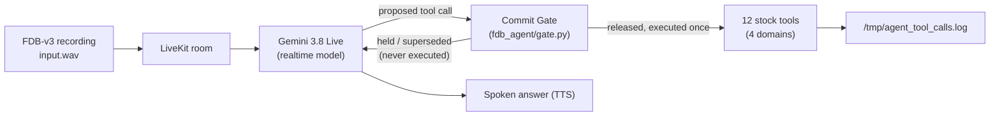

# Theme 05: Interruptible Real-Time Agents — FDB-v3 submission

## What it is

A LiveKit voice agent for **Full-Duplex-Bench v3** (the organizers' scored benchmark) that fixes the benchmark's single biggest failure mode — tools firing on a value the user is still in the middle of correcting. A **commit gate** sits between the realtime model and its 12 tool functions: it holds every proposed call until the user's turn has actually settled, drops a held call the moment a newer one supersedes it, and never executes the same call twice.

## Architecture



The gate (`fdb_agent/gate.py`, wired in `fdb_agent/gate_agent.py`):

- Holds a proposed call until the user has been quiet for **0.9 s** — or **1.8 s** if their last words trail off on a filler/hesitation/correction cue ("um", "wait", "actually", "no", "I mean", "or", "scratch that", …).
- **Supersedes** a held call the instant a newer call to the *same tool* arrives after the user speaks again — that's a correction, not a second request; the superseded call is told so and never runs.
- **Never executes an identical call twice** — canonicalized args (case/whitespace-insensitive) are checked against everything already executed; a repeat returns the cached result instead of re-calling the tool.
- Caps any hold at **8 s**, so a genuinely long pause can't stall the conversation forever.
- **Only executed calls are logged.** Held or superseded calls never touch `/tmp/agent_tool_calls.log` — nothing is hidden from the scorer, execution is just deferred until it's safe.

Added on 2026-09-30, after the final benchmark run (all in `fdb_agent/gate.py`, all covered by `fdb_agent/test_gate.py`, which passes):

- **Retraction handling** (`GATE_RETRACT`, default on). Follows the change-of-mind taxonomy of Zou et al. 2026 (arXiv 2604.00892): a user can *add* to, *revise*, or *retract* a request. Cues such as "never mind", "forget that", "don't book anything" drop a held call with no replacement; the Jev follow-up classifier gained a `retraction` label.
- **Conservative identifier canonicalization** (`GATE_ID_NORMALIZE`, default on). Applies to arguments named `*_id` / `*_number`. It joins only spelled-out *single characters* ("B-O-B-1-2" -> "BOB12"); it keeps letter case and real multi-character hyphens ("PO-999" stays "PO-999"). **This is a documented assumption**: we treat a separator between single characters as a speech-to-text artefact (the stock-prompt baseline shows it too), not as part of the identifier. If a real system used such separators meaningfully, this rule would be wrong for it.
- **Backchannel handling** (`GATE_BACKCHANNEL`, default on). "okay", "mm-hmm", "uh-huh", "got it" mean "I'm listening", not a new turn: no supersede, no retraction check, no Jev call, no "turn done" acknowledgement, and they do not count as a correction if the same tool is proposed again. Fillers ("uh", "um", "hmm") are deliberately *not* backchannels; they still signal hesitation. Motivated by S-MARC (arXiv 2602.11065), which models backchannel as its own class separate from turn-taking.
- **`GATE_LEAN` switch, "Jev as decider"** (default off). Jev may shorten a hold or classify a follow-up, but never lengthens a hold beyond the rule window. **It is a switch under practice-set evaluation and is not in the submitted configuration.**

**Status of these four.** The full-benchmark numbers in the Results section were measured *before* retraction, identifier canonicalization and backchannel handling existed, so none of those three is reflected in them; they are unit-tested but have **not** been scored on the practice set or the benchmark. Their defaults are on, so a fresh `reproduce.sh` run today includes them; set `GATE_RETRACT=0 GATE_ID_NORMALIZE=0 GATE_BACKCHANNEL=0` to run the configuration that produced the reported numbers.

### Design lineage / related work

- **Fast talker + slow thinker split**: our realtime model talks while the gate decides; this follows the same split as the OpenAI Realtime Agents chat-supervisor pattern, the LiveKit supervisor-pattern blog (2026-03-23) and LTS-VoiceAgent (arXiv 2601.19952). Our gate holds every tool call, so a slower check can run inside the hold. The escalation part is **planned, not implemented**.
- **Decider ladder, cheapest first**: rules, then Jev, in the same spirit as query routing in Hybrid LLM (ICLR 2024, arXiv 2404.14618), which sends easy queries to a cheap model and hard ones to a costly one. We borrow the idea of ordering deciders by cost; we do not reproduce their router.
- **User change-of-mind taxonomy**: addition / revision / retraction (Zou et al. 2026, arXiv 2604.00892), the basis for our follow-up classes.
- **Acoustic end-of-turn as a planned third decider**: Smart Turn v3.2 (Pipecat, BSD-2-Clause, ~8M parameters, CPU inference; see `project-log/RESEARCH_SMART_TURN.md`). **Not implemented**; it has not been evaluated on real voices or Indian-English accents.

## Why this design

Full-Duplex-Bench v3's own scoring is unforgiving of early commitment: a single wrong or extra tool call fails the entire scenario's strict Pass@1, even if the corrected call follows immediately after (`evaluate_pass_rate.py`'s multiset + precision check — verified by reading the benchmark's own code, not assumed). The paper's own published numbers (arXiv 2604.04847, verified against the paper directly) confirm this is a universal problem, not one model's quirk:

| System | Pass@1 | Notes |
|---|---|---|
| GPT-Realtime | 0.600 | Best overall, but only 58.8% on self-correction scenarios specifically |
| Gemini Live 3.1 | 0.540 | Task completion 4.25 s |
| Gemini Live 2.5 | 0.490 | |
| Cascaded (Whisper → GPT-4o → TTS) | 0.450 | Task completion 10.12 s (slowest in the paper); our reading: extra hops, and the text step loses hesitation cues in the audio |
| Grok | 0.430 | |
| Ultravox v0.7 | 0.410 | |

Self-correction is explicitly named in the paper as one of the two most consistent failure modes across *every* system tested — that's the gap this gate targets. (Our 0.9s/1.8s hold windows are a tuned starting point refined against our own synthetic dev set, `devset/scenarios.jsonl` — not a number taken from the paper; the paper does not publish a specific hesitation-pause duration, and we don't claim it does.)

## How we tuned (practice set, never the benchmark)

We never tune on FDB-v3's own 100 recordings — that's disqualifying. Instead we built our own **62-item practice set**: our 50 scenarios (`devset/scenarios.jsonl`, written from scratch against the tool signatures) plus 12 more pause-focused scenarios (`p01`–`p12`) contributed via a teammate's ("Lohit's") independent upgrade pack, all synthesized to audio with Kokoro TTS.

**A padding bug voided our first A/B test — worth stating honestly rather than hiding.** The benchmark's own `livekit_inference.py` records the agent for *exactly the input recording's duration* plus a short trailing window. Real FDB-v3 inputs run 40–59s, giving the agent 20+ seconds of room after the user stops talking. Our first Kokoro-synthesized clips were only 4–12s with ~2s of tail — so a call the gate correctly held for a second or two sometimes never got the chance to execute before the recording simply ended. That's not a gate failure, it's a test-harness mismatch we introduced. Fix: every dev-set input is now padded with 20s of trailing silence to match the real benchmark's margin. **Any comparison below marked "unpadded" is void for judging hold-length decisions** — we're keeping it in the table anyway, because the void result is itself a useful, honest data point about the harness.

| Run | Config | Strict pass | Stale calls (`must_not_call` hits) | Median latency |
|---|---|---|---|---|
| A | Rules-only gate, prompt v1, **unpadded** | 32/50 | 1/25 | — |
| B | Rules + Jev, **unpadded** | 24/50 — **void, recording-window artifact, not a real regression** | 0/25 | — |
| A2 | Rules-only gate, prompt v1, padded | 41/62 | 5/30 | 4.16 s |
| C | Jev + draft-call hold + dangling-word trigger + prompt v2, padded | 41/62 | 4/30 | 4.24 s |
| D | C + Gemini end-of-turn silence set to 1800 ms, padded | 40/62 | 5/30 | 5.28 s — **rejected** |

**What each component does:**
- **Commit gate** (`fdb_agent/gate.py`): holds a proposed call until the user's turn settles, supersedes a held call when a newer one for the same tool arrives, never executes an identical call twice.
- **Jev turn-state + follow-up classification** (`fdb_agent/jev.py`, TypeSafe Jev): a typed judgment on whether the turn actually sounds finished ("complete"/"continuing"/"unsure"), and on what a follow-up utterance does to a held call — with a **rules-only fallback** whenever Jev returns no answer or times out, so it can only ever help, never block a turn.
- **Draft-call hold** (`GATE_DRAFT_HOLD_S`): Gemini sometimes emits a placeholder call mid-sentence with empty or default arguments (an empty date, `bedrooms=0`, `quantity=1`) before the real call arrives — this holds a proposal that "looks draft" a little longer so the placeholder doesn't execute ahead of the real one.
- **Dangling-word trigger** (`GATE_DANGLING`, merged from Lohit's upgrade pack): extends the hold when the utterance trails off on an incomplete word.
- **Prompt rules** (`GATE_PROMPT=2`, merged prompt rules from the same upgrade pack): act on the last stated value, never ask a follow-up question, never claim a result before the tool returns.

**Honest conclusion:** on our dev set, Jev (config C) roughly **ties** the rules-only gate (config A2) on strict pass (41/62 both), with a modest reduction in stale calls (4/30 vs 5/30) — a real but small effect, not a decisive win. The residual failures share one shape: a sentence that already sounds grammatically complete, followed by a pause and then a correction ("Track order QM77 [1.6s pause] wait, no, QM78") — Gemini ends its turn right at the pause, and Jev *correctly* reports the turn as "complete" too, because at that point in time it genuinely does sound finished. **No turn-final judge — ours or Jev's — can foresee a correction that hasn't been spoken yet.** We tried buying more time against exactly this failure by increasing Gemini's own end-of-turn silence threshold to 1800ms (config D), but it made the stale-call rate worse again while adding over a second of latency (5.28s vs 4.24s) — rejected. The rest of the residual gap is TTS/ASR mishearing (e.g. "Vancouver" heard as "London", "K442" as "A442") and two cases where the model still asked a follow-up question despite the prompt rule against it — neither is something the gate or Jev can fix.

**Decision-level evidence, not just end-to-end pass rate** (`devset/eval_decisions.py`, scored against our own dev-set utterances, logged in `project-log/runs/2026-09-29_decision_eval.json`):

| Decision | Rules-only | Jev-only | **Combined (rules OR Jev)** |
|---|---|---|---|
| Turn-state accuracy | **0.796** | 0.714 | 0.735 |
| Mid-sentence pause catch | 0.60 | 0.64 | **0.68** |
| Correction-vs-addition | 0.963 | 0.963 | 0.963 (tie) |

This is why the shipped gate uses `GATE_COMBINE=either`: hold if *either* the rule-based logic or Jev thinks the user is still going, and only take the fast 0.4 s release when Jev says complete **and** the rules see no hesitation cue. Read plainly: **Jev alone does not beat the rules** on turn-state accuracy (0.714 vs 0.796); it adds 5 false "continuing" verdicts on genuinely complete sentences, which costs latency, not correctness. On **mid-sentence pauses** (utterances cut at a pause point, e.g. "flights to Amsterdam on…") Jev catches slightly more (0.64 vs 0.60), and the OR-combination catches the most (0.68: rules 15, Jev 16, combined 17 of 25), so the two largely overlap and combining them gives a small, real gain. Neither can catch a correction that follows a sentence that already sounds complete ("Track order QM77 … wait, no, QM78"); that remains the main open failure. Correction-vs-addition classification is a tie (0.963 each). Net: this is not "Jev is smarter than the rules"; requiring both to agree before an early release trades a little latency for catching the most pauses on our dev set.

## Results

Honest headline: **the full pipeline does not beat the stock baseline overall.** Judged pass rate is 61/100 for the pipeline against 62/100 for the stock agent (strict exact-match: 46/100 against 50/100). It gains in some slices and loses in others.

| System | Strict exact-match | Gemini 2.5 Pro judge (stand-in for GPT-4o) | Latency (first reply, median) | Source |
|---|---|---|---|---|
| Paper: GPT-Realtime | — | 0.600 | — | arXiv 2604.04847 |
| Paper: Gemini Live 3.1 | — | 0.540 | 4.25 s task completion | arXiv 2604.04847 |
| Paper: Cascaded (Whisper/GPT-4o/TTS) | — | 0.450 | 10.12 s task completion | arXiv 2604.04847 |
| **Ours: stock agent, no gate** (`baseline_agent.py`, `gemini-3.8-live`, all 100) | 50/100 | **62/100** | 3.92 s perceived (strict run); 4.00 s (`analyze_tool_latency.py`) | `project-log/SCORES.md`, `runs/2026-09-29_full_gemini3_8/` |
| **Ours: full pipeline** (`gate_agent.py`, rules + Jev as one decider, draft-call hold, dangling-word trigger, prompt v2) | 46/100 | **61/100** | 6.4 s | `project-log/SCORES.md`, `runs/2026-09-29_full_gate_gemini38_final/` |

**Judge caveat.** The organizers score with a GPT-4o judge. We had no OpenAI key, so our judged numbers use Gemini 2.5 Pro with the benchmark's own judge prompts unchanged (119/119 judge replies parsed for the pipeline, 121/121 for the baseline, no fallbacks). They are a stand-in and are **not** claimed to equal a GPT-4o-judged score. The paper's pass rates were scored with GPT-4o. Latency: the paper reports task-completion time; "perceived" / "first reply" is the time from the user's speech end to the agent's first reply.

**Where the pipeline gains and loses (judged, from `SCORES.md`):**

| Slice | Pipeline | Baseline |
|---|---|---|
| Overall | 61 | 62 |
| Housing | 0.346 | 0.192 |
| Self-correction | 0.529 | 0.471 |
| 3-tool requests | 0.375 | 0.312 |
| E-commerce | 0.586 | 0.759 |
| Pause | 0.50 | 0.611 |
| Travel | 0.65 | 0.65 |
| Finance | 0.88 | 0.88 |

Failure counts, judged: wrong tools 18 vs 18, wrong arguments 21 vs 20. We do not claim the gains come from the gate alone: the pipeline also includes a prompt change (`GATE_PROMPT=2`, e.g. "never ask a follow-up question") and we ran no full-benchmark ablation that separates the components.

**Failure analysis: late changes.** Of 14 same-tool repeats in the pipeline run, 4 were legitimate parallel pairs (the gate kept both; all 4 passed) and **10 were late changes, where the user resumed 1.4–10.7 s after the first call; all 10 failed.** No hold window can fix these: a hold long enough to catch them would stall every normal turn, and no turn-final judge can foresee a correction not yet spoken. This is the case that motivates *undo / rollback* rather than a longer hold, which is what the extension builds.

Baseline failure breakdown (exact-match, `SCORES.md`): by disfluency — pause 0.389, filler 0.448, self-correction 0.471, hesitation 0.50, false start 0.667; by domain — finance 0.88, e-commerce 0.759, travel 0.15, housing 0.115; failure causes — 32 wrong-argument, 10 missing-tool, 5 extra-tool, 3 missing+extra. Under the Gemini judge the baseline's travel score is 0.65 and housing 0.192 (wrong arguments drop from 32 to 20), so part of the strict travel/housing gap was wording, not wrong behavior.

**Not measured, so not claimed:** the paper rows are published numbers, not a like-for-like comparison with ours (different judge and model versions); we report no latency improvement (the pipeline's first reply is slower than the stock agent's); a second full run for variance was not done.

## Reproduce

`reproduce.sh` (repo root) is the one-command reproduction script; see `BUILD_PLAN_FDB_V3.md` §7 for exactly what each step does and its unverified assumptions. The organizers' 48 GB GPU is only used by the benchmark harness's own Parakeet ASR when it scores the agent's spoken answers — our agent and its reasoner (Gemini 3.8 Live, hosted) never touch that GPU themselves.


> **Config note.** The reported 61/100 (judged) and 46/100 (strict) were produced with the settings in `run.txt` of `runs/2026-09-29_full_gate_gemini38_final/`, which predate the retraction, identifier-canonicalization and backchannel switches. Those now default to on; to reproduce the reported configuration exactly, also set `GATE_RETRACT=0 GATE_ID_NORMALIZE=0 GATE_BACKCHANNEL=0`. `reproduce.sh` itself has not yet been run end to end on a clean machine.

The exact one-command reproduction, with our submitted (final) config:

```bash
./reproduce.sh   # = ./reproduce.sh fdb_agent/gate_agent.py gate_gemini38_final
```

It needs these environment variables set **by name only** in `~/theme5/Full-Duplex-Bench/v3/.env.local` (values are never written to this repo or asked for by any script):

**Required:**
- `LIVEKIT_URL`, `LIVEKIT_API_KEY`, `LIVEKIT_API_SECRET`
- `GOOGLE_API_KEY` — **default path**, a plain Gemini API key

**Optional:**
- `TYPESAFE_API_KEY` — enables Jev, the typed turn-state/follow-up classifier layered on the gate (`GATE_COMBINE=either`: hold if either the rule-based logic or Jev thinks the user is still going). **Without it, the gate falls back to rules-only automatically** — this is a tested code path (`fdb_agent/jev.py`), not a guess; `reproduce.sh` prints `Jev disabled: gate uses rules only` and continues rather than failing.
- `OPENAI_API_KEY` (optionally `OPENAI_BASE_URL` for an Azure OpenAI deployment) — enables `--use-llm` judge scoring (the organizers' GPT-4o judge). **Without it, scoring falls back to exact-match** — still a real, reported number, just a stricter one.
- *(optional alternative to `GOOGLE_API_KEY`)* `GOOGLE_GENAI_USE_VERTEXAI=true`, `GOOGLE_CLOUD_PROJECT`, `GOOGLE_CLOUD_LOCATION` — Vertex AI via Application Default Credentials, used in our own development environment because our org's Cloud policy blocks plain API keys; **not required for reproduction**, the plain-key path above is simpler for anyone re-running this and is what the organizers' own notes describe ("for Gemini we will not need the key").

```bash
./reproduce.sh fdb_agent/gate_agent.py gate_gemini38_final   # our final submitted config (default)
./reproduce.sh fdb_agent/baseline_agent.py gemini3_8         # stock baseline, for comparison
```

## Extension: in-car assistant with slow / failing tool recovery

The organizer briefing (`project-log/meetings/2026-09-29_organizer_briefing_notes.md`) confirmed FDB-v3 has no video input in Round 1 and named tool failure and variable latency as something they want showcased: *"you should be able to recover — retry, close the session, move to human in the loop."* The extension (`extension/`, design in `extension/DESIGN.md`) reuses the same talker + commit-gate pattern behind a recovery layer, for an audio-only in-car assistant (reroute, traffic, EV charging lookup and booking, roadside assistance) with mock tools:

- **Timeout and retry with backoff** for plain failures; a state-changing call that *times out* is never auto-retried, because a timeout is ambiguous (did the booking land?).
- **Idempotency**: calls are keyed by tool + canonicalized arguments; a repeated call that already succeeded returns the cached result and never re-runs the tool.
- **Supersede** a call that is still pending when the driver changes their mind.
- **Rollback** when the change of mind arrives *after* the call succeeded: a compensating call (`cancel_charging_booking`) runs first, the new booking only if the compensation succeeded; if compensation fails, it hands off to a human instead of booking a second time.
- **Read-back / progress**: spoken "still checking..." while a slow tool runs (never a claim of completion), a spoken confirmation of what was cancelled and booked, and a human-handoff reference after repeated failures.

**Status:** the offline core (`recovery.py`, `mock_tools.py`, `test_recovery.py`) passes 35/35 offline tests. The LiveKit agent `extension/ext_agent.py` is written but had **not been run live** as of the last entry in `project-log/WORKLOG.md`; the demo video's extension segment depends on that live run (see `project-log/VIDEO_SCRIPT.md`). The mock tools are deterministic stand-ins, not real vehicle or booking services.

## Honest limitations

- **The pipeline does not beat the stock baseline overall** (61 vs 62 judged, 46 vs 50 strict); it wins housing, self-correction and 3-tool requests and loses e-commerce and pause. Its first reply is slower (6.4 s vs 4.00 s median).
- **Single full run per configuration.** No second run for variance; run-to-run noise on 100 items is not measured, so 61 vs 62 is not a distinguishable difference.
- **Judge is a stand-in.** All judged numbers use Gemini 2.5 Pro, not the organizers' GPT-4o judge.
- **Late changes are not fixable by holding** (10 of 10 failed); only undo/rollback addresses them, and that exists in the extension, not in the benchmark agent.
- **Post-run additions are unscored.** Retraction, identifier canonicalization and backchannel handling were added after the final run (unit-tested only); `GATE_LEAN` is a switch under practice-set evaluation, not in the submitted config. The acoustic end-of-turn decider and escalation to a thinking model are planned, not built.
- **Identifier canonicalization is an assumption** (single-character separators are speech artefacts).
- **Cloud-dependent.** The reasoner is a hosted realtime model (Gemini 3.8 Live); no fully local fallback in the current build.
- **Tuned only on our own synthetic dev set** (`devset/scenarios.jsonl`, plus 12 pause scenarios from a teammate; 62 items in total, Kokoro TTS audio) — never on FDB-v3's own 100 recordings, per the organizers' disqualification rule. Timing constants are our best guess refined on synthetic data.
- **`reproduce.sh` has not been run end to end on a clean machine** (`project-log/OBJECTIVES.md`, B1); the extension has not been run live.
- **`book_flight` argument scope.** The stock tool only takes `passenger_name`, no `flight_id` — an open question for how the judge treats any expected `flight_id` reference (`project-log/STATUS.md`).

## Declared models / APIs

- **Reasoner:** Gemini 3.8 Live (Google), via a plain API key by default, or Vertex AI with ADC in our own dev environment
- **Voice infrastructure:** LiveKit Cloud (real-time audio room, required by the benchmark's own harness)
- **Decision layer (optional):** TypeSafe Jev (`typesafe-sdk` 0.7.2), with automatic rules-only fallback
- **Judge:** the organizers' GPT-4o judge is not wired in; our reported judged numbers use Gemini 2.5 Pro (Vertex) as a stand-in with the benchmark's prompts unchanged
- **Scoring ASR:** NVIDIA Parakeet-TDT-0.6B-v2 — run by the benchmark's own scorer, not by our agent
- **Dev-set TTS:** Kokoro-82M, for our own practice audio only

## AI usage

This project was built with AI coding assistance: Claude (Sonnet, this session and others, as lead engineering assistant) and Gemini CLI/Antigravity (as a junior assistant for light, well-scoped research tasks — see `project-log/GEMINI_TASKS.md`). The organizers' AI-usage declaration form is filled out accordingly (see `project-log/STATUS.md`'s checklist).

## History

This repository began as the Samsung PRISM participant kit (a local text/audio/visual interruption-handling harness, scored ~57–84 on its own evaluator — see `project-log/SCORES.md`'s "Participant kit" table). On 2026-09-26 the official scoring guide moved to Full-Duplex-Bench v3, retiring that harness as the scored benchmark; this README now describes the FDB-v3 submission. The original kit's code, docs (`docs/PROTOCOL.md`, `docs/SCORING.md`, etc.) and scenarios are kept in the repository as the reusable base for the extension work above, but are no longer the graded harness.
