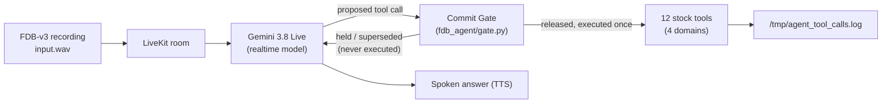

# Theme 05: Interruptible Real-Time Agents — FDB-v3 submission

## What it is

A LiveKit voice agent for **Full-Duplex-Bench v3** (the organizers' scored benchmark) that fixes the benchmark's single biggest failure mode — tools firing on a value the user is still in the middle of correcting. A **commit gate** sits between the realtime model and its 12 tool functions: it holds every proposed call until the user's turn has actually settled, drops a held call the moment a newer one supersedes it, and never executes the same call twice.

## Architecture



The gate (`fdb_agent/gate.py`, wired in `fdb_agent/gate_agent.py`):

- Holds a proposed call until the user has been quiet for **0.9 s** — or **1.8 s** if their last words trail off on a filler/hesitation/correction cue ("um", "wait", "actually", "no", "I mean", "or", "scratch that", …).
- **Supersedes** a held call the instant a newer call to the *same tool* arrives after the user speaks again — that's a correction, not a second request; the superseded call is told so and never runs.
- **Never executes an identical call twice** — canonicalized args (case/whitespace-insensitive) are checked against everything already executed; a repeat returns the cached result instead of re-calling the tool.
- Caps any hold at **8 s**, so a genuinely long pause can't stall the conversation forever.
- **Only executed calls are logged.** Held or superseded calls never touch `/tmp/agent_tool_calls.log` — nothing is hidden from the scorer, execution is just deferred until it's safe.

## Why this design

Full-Duplex-Bench v3's own scoring is unforgiving of early commitment: a single wrong or extra tool call fails the entire scenario's strict Pass@1, even if the corrected call follows immediately after (`evaluate_pass_rate.py`'s multiset + precision check — verified by reading the benchmark's own code, not assumed). The paper's own published numbers (arXiv 2604.04847, verified against the paper directly) confirm this is a universal problem, not one model's quirk:

| System | Pass@1 | Notes |
|---|---|---|
| GPT-Realtime | 0.600 | Best overall, but only 58.8% on self-correction scenarios specifically |
| Gemini Live 3.1 | 0.540 | Task completion 4.25 s |
| Gemini Live 2.5 | 0.490 | |
| Cascaded (Whisper → GPT-4o → TTS) | 0.450 | Task completion 10.12 s (slowest in the paper); our reading: extra hops, and the text step loses hesitation cues in the audio |
| Grok | 0.430 | |
| Ultravox v0.7 | 0.410 | |

Self-correction is explicitly named in the paper as one of the two most consistent failure modes across *every* system tested — that's the gap this gate targets. (Our 0.9s/1.8s hold windows are a tuned starting point refined against our own synthetic dev set, `devset/scenarios.jsonl` — not a number taken from the paper; the paper does not publish a specific hesitation-pause duration, and we don't claim it does.)

## How we tuned (practice set, never the benchmark)

We never tune on FDB-v3's own 100 recordings — that's disqualifying. Instead we built our own **62-item practice set**: our 50 scenarios (`devset/scenarios.jsonl`, written from scratch against the tool signatures) plus 12 more pause-focused scenarios (`p01`–`p12`) contributed via a teammate's ("Lohit's") independent upgrade pack, all synthesized to audio with Kokoro TTS.

**A padding bug voided our first A/B test — worth stating honestly rather than hiding.** The benchmark's own `livekit_inference.py` records the agent for *exactly the input recording's duration* plus a short trailing window. Real FDB-v3 inputs run 40–59s, giving the agent 20+ seconds of room after the user stops talking. Our first Kokoro-synthesized clips were only 4–12s with ~2s of tail — so a call the gate correctly held for a second or two sometimes never got the chance to execute before the recording simply ended. That's not a gate failure, it's a test-harness mismatch we introduced. Fix: every dev-set input is now padded with 20s of trailing silence to match the real benchmark's margin. **Any comparison below marked "unpadded" is void for judging hold-length decisions** — we're keeping it in the table anyway, because the void result is itself a useful, honest data point about the harness.

| Run | Config | Strict pass | Stale calls (`must_not_call` hits) | Median latency |
|---|---|---|---|---|
| A | Rules-only gate, prompt v1, **unpadded** | 32/50 | 1/25 | — |
| B | Rules + Jev, **unpadded** | 24/50 — **void, recording-window artifact, not a real regression** | 0/25 | — |
| A2 | Rules-only gate, prompt v1, padded | 41/62 | 5/30 | 4.16 s |
| C | Jev + draft-call hold + dangling-word trigger + prompt v2, padded | 41/62 | 4/30 | 4.24 s |
| D | C + Gemini end-of-turn silence set to 1800 ms, padded | 40/62 | 5/30 | 5.28 s — **rejected** |

**What each component does:**
- **Commit gate** (`fdb_agent/gate.py`): holds a proposed call until the user's turn settles, supersedes a held call when a newer one for the same tool arrives, never executes an identical call twice.
- **Jev turn-state + follow-up classification** (`fdb_agent/jev.py`, TypeSafe Jev): a typed judgment on whether the turn actually sounds finished ("complete"/"continuing"/"unsure"), and on what a follow-up utterance does to a held call — with a **rules-only fallback** whenever Jev returns no answer or times out, so it can only ever help, never block a turn.
- **Draft-call hold** (`GATE_DRAFT_HOLD_S`): Gemini sometimes emits a placeholder call mid-sentence with empty or default arguments (an empty date, `bedrooms=0`, `quantity=1`) before the real call arrives — this holds a proposal that "looks draft" a little longer so the placeholder doesn't execute ahead of the real one.
- **Dangling-word trigger** (`GATE_DANGLING`, merged from Lohit's upgrade pack): extends the hold when the utterance trails off on an incomplete word.
- **Prompt rules** (`GATE_PROMPT=2`, merged prompt rules from the same upgrade pack): act on the last stated value, never ask a follow-up question, never claim a result before the tool returns.

**Honest conclusion:** on our dev set, Jev (config C) roughly **ties** the rules-only gate (config A2) on strict pass (41/62 both), with a modest reduction in stale calls (4/30 vs 5/30) — a real but small effect, not a decisive win. The residual failures share one shape: a sentence that already sounds grammatically complete, followed by a pause and then a correction ("Track order QM77 [1.6s pause] wait, no, QM78") — Gemini ends its turn right at the pause, and Jev *correctly* reports the turn as "complete" too, because at that point in time it genuinely does sound finished. **No turn-final judge — ours or Jev's — can foresee a correction that hasn't been spoken yet.** We tried buying more time against exactly this failure by increasing Gemini's own end-of-turn silence threshold to 1800ms (config D), but it made the stale-call rate worse again while adding over a second of latency (5.28s vs 4.24s) — rejected. The rest of the residual gap is TTS/ASR mishearing (e.g. "Vancouver" heard as "London", "K442" as "A442") and two cases where the model still asked a follow-up question despite the prompt rule against it — neither is something the gate or Jev can fix.

**Decision-level evidence, not just end-to-end pass rate** (`devset/eval_decisions.py`, scored against our own dev-set utterances, logged in `project-log/runs/2026-09-29_decision_eval.json`):

| Decision | Rules-only | Jev-only | **Combined (rules OR Jev)** |
|---|---|---|---|
| Turn-state accuracy | **0.796** | 0.714 | 0.735 |
| Mid-sentence pause catch | 0.60 | 0.64 | **0.68** |
| Correction-vs-addition | 0.963 | 0.963 | 0.963 (tie) |

This is why the shipped gate uses `GATE_COMBINE=either`: hold if *either* the rule-based logic or Jev thinks the user is still going, and only take the fast 0.4 s release when Jev says complete **and** the rules see no hesitation cue. Read plainly: **Jev alone does not beat the rules** on turn-state accuracy (0.714 vs 0.796); it adds 5 false "continuing" verdicts on genuinely complete sentences, which costs latency, not correctness. On **mid-sentence pauses** (utterances cut at a pause point, e.g. "flights to Amsterdam on…") Jev catches slightly more (0.64 vs 0.60), and the OR-combination catches the most (0.68: rules 15, Jev 16, combined 17 of 25), so the two largely overlap and combining them gives a small, real gain. Neither can catch a correction that follows a sentence that already sounds complete ("Track order QM77 … wait, no, QM78"); that remains the main open failure. Correction-vs-addition classification is a tie (0.963 each). Net: this is not "Jev is smarter than the rules"; requiring both to agree before an early release trades a little latency for catching the most pauses on our dev set.

## Results

| System | Pass@1 (exact-match) | Pass@1 (`--use-llm` GPT-4o judge) | Latency | Source |
|---|---|---|---|---|
| Paper: GPT-Realtime | — | 0.600 | — | arXiv 2604.04847 |
| Paper: Gemini Live 3.1 | — | 0.540 | 4.25 s task completion | arXiv 2604.04847 |
| Paper: Cascaded (Whisper/GPT-4o/TTS) | — | 0.450 | 10.12 s task completion | arXiv 2604.04847 |
| **Ours: stock agent, no gate** (`baseline_agent.py`, `gemini-3.8-live`, all 100) | **0.50 (50/100)** | TBD (no judge key yet) | 3.92 s median perceived (first reply); task completion TBD | `project-log/SCORES.md`, `runs/2026-09-29_full_gemini3_8/` |
| **Ours: with commit gate** (`gate_agent.py`, `GATE_COMBINE=either` — rules + Jev as one decider, draft-call hold + dangling-word trigger + prompt v2) | **TBD — full 100-recording run in progress** (`gate_gemini38_final`, started ~15:23 UTC 2026-09-29; an earlier config-C-only run was stopped at 10/100 once the combined decider was adopted) | TBD | TBD | `project-log/runs/` (link added once frozen) |

> The paper's pass rates were scored with the GPT-4o judge; our exact-match numbers are stricter, so they are **not** directly comparable until our runs are re-scored with the judge. Latency: the paper reports task-completion time; "perceived" is time from the user's speech end to the agent's first reply.

Baseline failure breakdown (exact-match, from `project-log/SCORES.md`): by disfluency — pause 0.389, filler 0.448, self-correction 0.471, hesitation 0.50, false start 0.667; by domain — finance 0.88, e-commerce 0.759, travel 0.15, housing 0.115; failure causes — 32 wrong-argument, 10 missing-tool, 5 extra-tool, 3 missing+extra.

All numbers above without a source link are **TBD** and will be filled in from a `runs/` folder once frozen — no number here is reported without a log behind it.

## Reproduce

`reproduce.sh` (repo root) is the one-command reproduction script; see `BUILD_PLAN_FDB_V3.md` §7 for exactly what each step does and its unverified assumptions. The organizers' 48 GB GPU is only used by the benchmark harness's own Parakeet ASR when it scores the agent's spoken answers — our agent and its reasoner (Gemini 3.8 Live, hosted) never touch that GPU themselves.

The exact one-command reproduction, with our submitted (final) config:

```bash
./reproduce.sh   # = ./reproduce.sh fdb_agent/gate_agent.py gate_gemini38_final
```

It needs these environment variables set **by name only** in `~/theme5/Full-Duplex-Bench/v3/.env.local` (values are never written to this repo or asked for by any script):

**Required:**
- `LIVEKIT_URL`, `LIVEKIT_API_KEY`, `LIVEKIT_API_SECRET`
- `GOOGLE_API_KEY` — **default path**, a plain Gemini API key

**Optional:**
- `TYPESAFE_API_KEY` — enables Jev, the typed turn-state/follow-up classifier layered on the gate (`GATE_COMBINE=either`: hold if either the rule-based logic or Jev thinks the user is still going). **Without it, the gate falls back to rules-only automatically** — this is a tested code path (`fdb_agent/jev.py`), not a guess; `reproduce.sh` prints `Jev disabled: gate uses rules only` and continues rather than failing.
- `OPENAI_API_KEY` (optionally `OPENAI_BASE_URL` for an Azure OpenAI deployment) — enables `--use-llm` judge scoring (the organizers' GPT-4o judge). **Without it, scoring falls back to exact-match** — still a real, reported number, just a stricter one.
- *(optional alternative to `GOOGLE_API_KEY`)* `GOOGLE_GENAI_USE_VERTEXAI=true`, `GOOGLE_CLOUD_PROJECT`, `GOOGLE_CLOUD_LOCATION` — Vertex AI via Application Default Credentials, used in our own development environment because our org's Cloud policy blocks plain API keys; **not required for reproduction**, the plain-key path above is simpler for anyone re-running this and is what the organizers' own notes describe ("for Gemini we will not need the key").

```bash
./reproduce.sh fdb_agent/gate_agent.py gate_gemini38_final   # our final submitted config (default)
./reproduce.sh fdb_agent/baseline_agent.py gemini3_8         # stock baseline, for comparison
```

## Extension (placeholder — not yet built)

**Audio-only "slow/failing tool recovery" use case.** The organizer briefing (`project-log/meetings/2026-09-29_organizer_briefing_notes.md`) confirmed FDB-v3 has no video input in Round 1 and named exactly this scenario as something they want showcased: *"There will be instances where the tasks will fail... there will be instances where the latency will be variable... if you can showcase [that], that will be very good... you should be able to recover — retry, close the session, move to human in the loop."* The plan is to reuse the same coordinator (talker/reasoner/commit gate) behind a second adapter, feeding it slow or failing mock tool calls instead of LiveKit audio, and show: a retried read-only call, a state-changing call that is never blindly retried, and a clean handoff when recovery isn't possible. **Not implemented yet** — this section is a placeholder until it is.

## Honest limitations

- **Single reported run so far.** The results table above is one baseline pass; the gate run and a second full run (for mean + variance, per `BUILD_PLAN_FDB_V3.md`'s own plan) are still pending.
- **Exact-match scoring only, for now.** No OpenAI/Azure key is wired in yet, so `--use-llm` numbers are TBD; exact-match can penalize a correct answer in a different valid format.
- **Cloud-dependent.** The reasoner is a hosted realtime model (Gemini 3.8 Live); there's no fully local fallback in the current build, though `BUILD_PLAN_FDB_V3.md` scopes one as a stretch goal if the deadline moves.
- **Tuned only on our own synthetic dev set** (`devset/scenarios.jsonl`, 40 scenarios written from scratch against the tool signatures) — never on FDB-v3's own 100 test recordings, per the organizers' disqualification rule. This means our gate's timing constants are our best guess refined on synthetic data, not on the actual test distribution.
- **Extension is not yet built** (see above) — currently a stated plan, not working code.
- **`book_flight` argument scope.** The stock tool only takes `passenger_name`, no `flight_id` — an open question for how the judge treats any expected `flight_id` reference (`project-log/STATUS.md`).

## Declared models / APIs

- **Reasoner:** Gemini 3.8 Live (Google), via a plain API key by default, or Vertex AI with ADC in our own dev environment
- **Voice infrastructure:** LiveKit Cloud (real-time audio room, required by the benchmark's own harness)
- **Judge (optional):** GPT-4o, via OpenAI API or an Azure OpenAI deployment — declared, not yet wired in
- **Scoring ASR:** NVIDIA Parakeet-TDT-0.6B-v2 — run by the benchmark's own scorer, not by our agent

## AI usage

This project was built with AI coding assistance: Claude (Sonnet, this session and others, as lead engineering assistant) and Gemini CLI/Antigravity (as a junior assistant for light, well-scoped research tasks — see `project-log/GEMINI_TASKS.md`). The organizers' AI-usage declaration form is filled out accordingly (see `project-log/STATUS.md`'s checklist).

## History

This repository began as the Samsung PRISM participant kit (a local text/audio/visual interruption-handling harness, scored ~57–84 on its own evaluator — see `project-log/SCORES.md`'s "Participant kit" table). On 2026-09-26 the official scoring guide moved to Full-Duplex-Bench v3, retiring that harness as the scored benchmark; this README now describes the FDB-v3 submission. The original kit's code, docs (`docs/PROTOCOL.md`, `docs/SCORING.md`, etc.) and scenarios are kept in the repository as the reusable base for the extension work above, but are no longer the graded harness.
