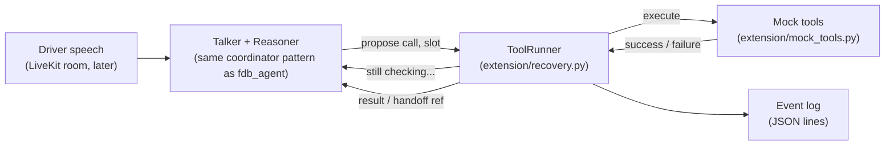

# Extension: in-car assistant with slow / failing tool recovery

A use case entirely outside FDB-v3: an in-car voice assistant that reroutes navigation,
checks traffic, finds and books EV charging, and calls roadside assistance — chosen because
the organizer briefing named exactly this behavior as something to showcase (*"there will be
instances where the tasks will fail... the latency will be variable... you should be able to
recover"* — `project-log/meetings/2026-09-29_organizer_briefing_notes.md`, fact 9), and
because FDB-v3 has no video in Round 1, so this stays audio/text-only by design, not by
compromise.

**Status: design + offline core built (`recovery.py`, `mock_tools.py`, `test_recovery.py`,
all offline tests passing). Not yet wired into a live LiveKit agent** — that happens after
the gate run finishes (see "How this plugs in" below).

## The scenario

Driver: *"Reroute me to the airport... actually, no, take me downtown instead. And check
traffic on the way. Also find me a charging station near downtown, CCS connector, and book
the 6pm slot. If none of that works, get me roadside assistance."*

## The 5 mock tools (`mock_tools.py`)

| Tool | Kind | Behavior |
|---|---|---|
| `reroute_navigation(destination)` | state-changing, fast | Always succeeds quickly |
| `check_traffic(route_id)` | read-only, **slow** (3–8 s) | Always succeeds, but takes a while |
| `find_charging_station(near, connector_type)` | read-only, **intermittent failures** | Fails the first 2 attempts for a given (near, connector) pair, then succeeds — a flaky upstream, not a permanent outage |
| `book_charging_slot(station_id, time_slot)` | **state-changing, must be idempotent** | Booking the same station+slot twice returns the same booking, never creates a second one |
| `call_roadside_assistance(issue)` | state-changing, **permanently down** in this mock | Always fails — exists specifically to exercise the handoff path |

## Behaviors, and where they're implemented/tested

**(a) Slow tool → talker stays informative, never claims done.**
`ToolRunner.on_progress(tool, call_id)` fires repeatedly (every `progress_after_s`, default
1.5 s) while a call is still in flight. A LiveKit talker would use this to say something
like *"still checking traffic..."* — the callback only ever fires before `succeeded`/`failed`
is logged, never after. Tested in `test_recovery.py`, scenario (a).

**(b) Retry with backoff; a state-changing call that already succeeded is never re-run.**
On a plain failure (`ToolFailure`), the runner retries with exponential backoff
(`backoff_base_s * 2^attempt`, capped at `backoff_cap_s`) up to `max_retries` times within
one `run()` call. Separately — and this is the important safety property — **every call is
keyed by tool name + canonicalized arguments** (same idea as `fdb_agent/gate.py`'s dedupe):
if that exact call already succeeded, a repeat returns the cached result immediately and
never touches the real tool again. This is what makes `book_charging_slot` safe to call
twice with the same arguments. Tested in scenario (b).

**(c) User interrupts / changes their mind mid-wait → cancel or supersede.**
Calls are grouped by `slot` (e.g. `"destination"` for any reroute request). A new call in the
same slot — or an explicit interruption signal — calls `ToolRunner.supersede(slot)`, which
cancels the in-flight `asyncio.Task` if it hasn't finished and logs a `superseded` event. A
call that already completed is untouched; only a call still pending or backing off is
affected. Tested in scenario (c): reroute to the airport is superseded mid-flight by "actually,
downtown instead," and the airport reroute never completes or gets acted on.

**(d) After N consecutive failures on the same request → graceful handoff.**
`failures[slot]` counts consecutive failed `run()` calls; it resets to 0 on any success.
Once it reaches `handoff_after_failures` (default 3), the runner returns
`{"status": "handoff", "reference": "HANDOFF-0001"}` and calls `on_handoff(tool, call_id, ref)`
instead of failing silently — the talker would say *"I've passed this to a human agent,
reference HANDOFF-0001."* Tested in scenario (d), using the permanently-failing
`call_roadside_assistance`. **A state-changing call that times out (as opposed to a plain
`ToolFailure`) is never auto-retried at all** — a timeout is ambiguous (did the booking land
before the timeout or not?), so it goes straight to the failure/handoff path rather than
risking a duplicate state change. Also tested in scenario (d).

**(e) Everything logged.**
`EventLog` records one JSON-serializable `Event` per state transition — `proposed`,
`started`, `retry`, `succeeded`, `failed`, `cancelled`, `superseded`, `duplicate`, `handoff` —
with a `call_id`, `tool`, `detail` string and monotonic timestamp. Nothing is hidden: a
superseded or cancelled call is logged as such, not silently dropped. Tested in scenario (e):
every event line parses as JSON and every expected kind appears somewhere in the test run.

## Architecture

## How this plugs into a LiveKit agent (for the lead session, after the gate run)

`ToolRunner` has **no LiveKit imports**, deliberately — same principle as
`fdb_agent/gate.py`. To wire it into a live agent:

1. Wrap each real tool function the same way `fdb_agent/gate.py`'s `gate_tools()` wraps the
   stock 12 tools: bind positional args to parameter names, call `runner.run(name, args,
   lambda: real_tool(*a, **kw), slot=..., state_changing=...)`.
2. Set `runner.on_progress` to speak a short, content-aware line through the session's TTS
   (e.g. *"still looking for a charging station..."*) — never a claim of completion.
3. Set `runner.on_handoff` to speak the reference number and (optionally) end the tool loop
   for that request.
4. Call `runner.supersede(slot)` from the same turn-detection signal `gate.py` already uses
   (`on_user_state("speaking")` / a new transcript) when the user starts a new request in a
   slot that already has something pending.
5. Pick `slot` names per logical request (e.g. `"destination"`, `"charging_search"`,
   `"charging_booking"`, `"roadside"`) — not per tool name — so a correction to "the
   charging station search" doesn't accidentally supersede an unrelated booking in flight.

This is a plan for the lead session to execute once the current gate run finishes (per the
task's rule not to start any agent or touch `fdb_agent/` from this session) — not yet done.

## 60–90 s demo script (for the video)

1. *(0–15s)* Driver: "Reroute to the airport." → instant reroute confirmed.
2. *(15–30s)* Driver: "Actually, check traffic on the way to downtown instead." → talker says
   "still checking traffic..." while `check_traffic` runs its slow (3–8s) mock delay, then
   reports congestion.
3. *(30–50s)* Driver: "Find me a charging station near downtown, CCS." → first two lookups
   fail internally (flaky mock), retried automatically with backoff, third succeeds — driver
   only hears the final answer, not the retries. Driver: "Book the 6pm slot" → confirmed once;
   driver repeats "book it again" as a joke/test → same booking ID returned, no duplicate.
4. *(50–65s)* Driver: "Reroute to the mall instead — no wait, actually, forget it, call
   roadside assistance, my tire's flat." → the pending reroute is superseded/dropped cleanly.
5. *(65–90s)* Roadside assistance fails twice (mock is permanently down) → talker says
   "I've passed this to a human agent, reference HANDOFF-0001" instead of failing silently or
   retrying forever.
