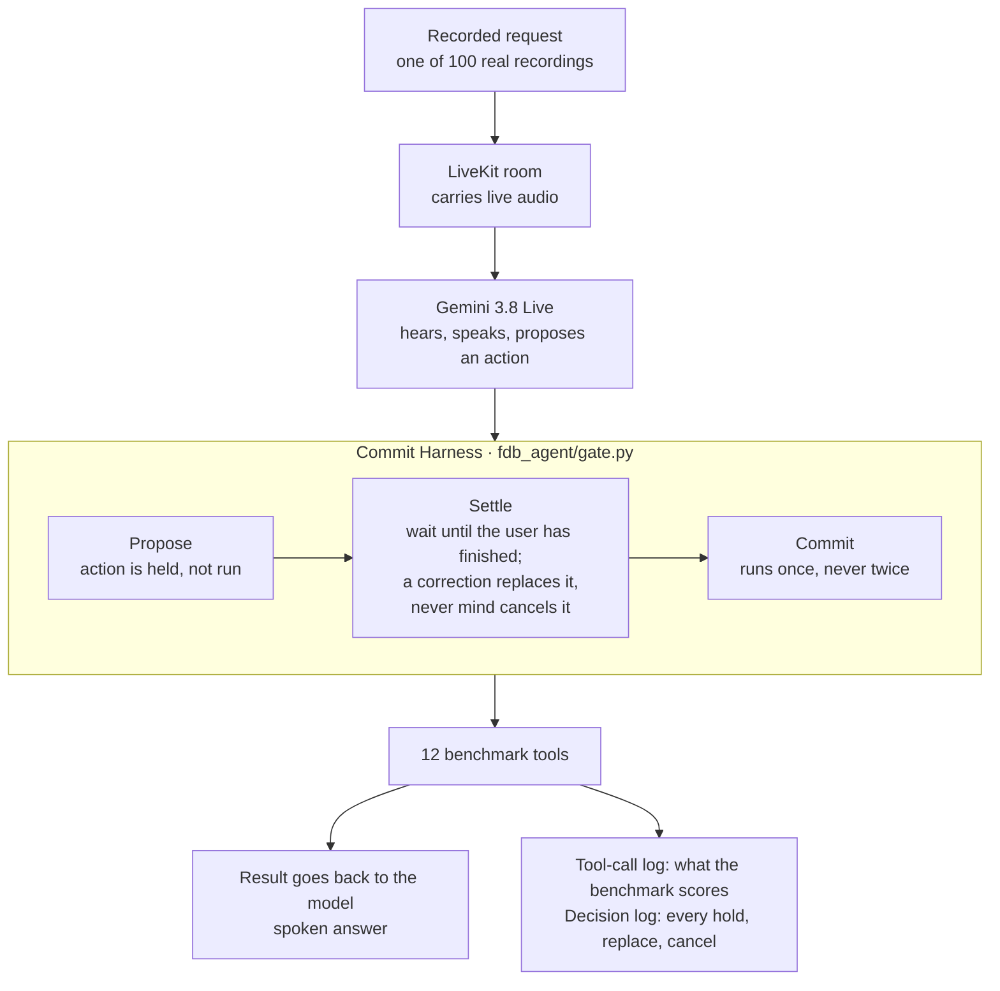
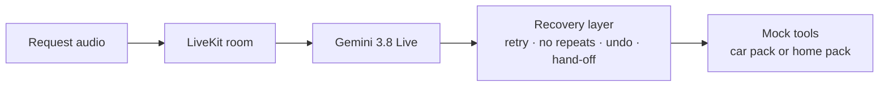

# Architecture (one page)

We built two voice agents on the same voice model. The **benchmark agent** is what we submit for the score. The **extension agent** shows what happens when tools are slow or fail. They are separate programs; their two layers are not yet combined.

## 1. Benchmark agent (submitted)

| Part | What it does | File | Submitted run |
|---|---|---|---|
| Voice model | Gemini 3.8 Live through LiveKit Agents: hears, speaks, chooses tools | `fdb_agent/models.py`, `gate_agent.py` | On |
| Prompt rules | Instructions to the model: the last value said wins, use values exactly as spoken, never say an action is done before it ran | `gate_agent.py` (`GATE_PROMPT=2`) | On |
| Commit Harness | Holds, replaces, cancels, never repeats; logs every decision | `fdb_agent/gate.py` | On |
| Reflex | Looks at words such as "um" or "no, sorry". Waits 0.9 s, or 1.8 s if the user sounds unsure | inside `gate.py` | On |
| Reasoner | TypeSafe Jev judges whether the user has finished. If it takes longer than 0.8 s, Reflex decides alone | `fdb_agent/jev.py` | On |
| Identifier rule | Joins a spelled-out ID ("B-O-B-1-2") into "BOB12" before the tool runs | inside `gate.py` | On |
| Listener | Smart Turn v3.2 listens to the tone of voice. Wrong too often in our tests | `fdb_agent/smart_turn.py` | Off |
| Acknowledgement and must-speak watchdog | A short "one moment" and a nudge if the agent stays silent | `fdb_agent/responsive.py` | Off, not tried live |

Settings of the submitted run: `GATE_COMBINE=either GATE_JEV=1 GATE_DRAFT_HOLD_S=2.5 GATE_DANGLING=1 GATE_PROMPT=2`, quiet 0.9 / 1.8 s, `GATE_LEAN=1 GATE_BACKCHANNEL=1 GATE_RETRACT=1 GATE_ID_NORMALIZE=1 GATE_SMART_TURN=0`.

## 2. Extension agent (in-car EV assistant, home assistant)

| Part | What it does | File |
|---|---|---|
| Recovery layer | Time limit per attempt, quiet retry, no repeat of an identical request, replace a call that is still pending, undo (cancel the old action, then do the new one), hand-off to a human after two failed requests, event log | `extension/recovery.py` |
| Tool packs | Mock car tools (reroute, traffic, charger search, booking, roadside) and mock home tools (AC, lights, washer, energy, find phone, service centre) | `extension/mock_tools.py`, `mock_tools_home.py` |
| Agent | Wires the model, the recovery layer and one pack (`EXT_PACK=car` or `home`) | `extension/ext_agent.py` |
| Plugin bridge | A mock plugin server driven through the recovery layer; tested offline, not attached to the agent | `extension/mcp_bridge.py`, `mcp_home_server.py` |
| Local fallback | FunctionGemma through Ollama; about 30% correct in our test, not attached to the agent | `extension/local_fallback.py` |

## 3. What runs where

- Hosted services: Gemini 3.8 Live (voice model), TypeSafe Jev (optional), Gemini 2.5 Pro (judge, scoring only).
- On the machine: the harness, the recovery layer, the benchmark's runner and tools. Our code needs no GPU.

## 4. What we measured, in plain words

**Did the harness raise the score?** Hardly. In 100 recordings it changed what the agent did in only 2. Gemini already waits until it thinks the user has finished before it asks for an action, so there is almost never a wrong action left to stop.

**Then why 67 instead of 62?** Two other things we added: the prompt rules and the identifier rule. We switched them on together, so we cannot say which one helped more.

**What does the harness cost?** It waits about 0.9 s before every action. That is the main reason our agent replies in 5.3 s and the stock agent in 3.9 s.

**What still fails?** In ten recordings the user changed their mind after the action had already run. Waiting cannot fix that. It needs undo, and undo exists only in the extension agent.

**What comes next?** Put both layers in one agent: the harness in front, the recovery layer behind it, so the benchmark agent can also undo.

More detail: `README_FULL.md` (design, results, limitations), `project-log/SCORES.md` (all numbers), `project-log/WORKLOG.md` (history).
